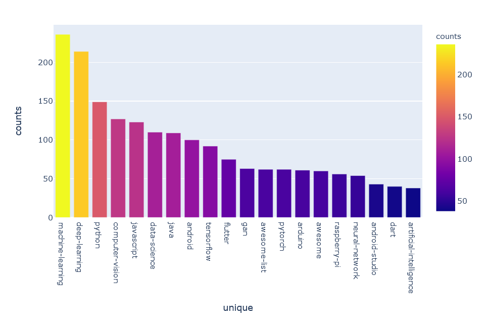
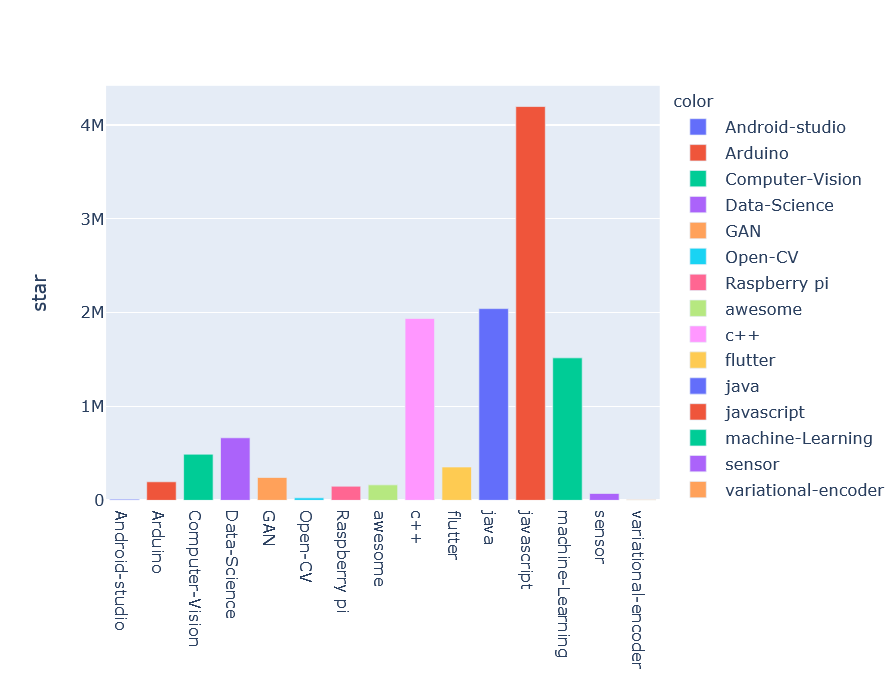
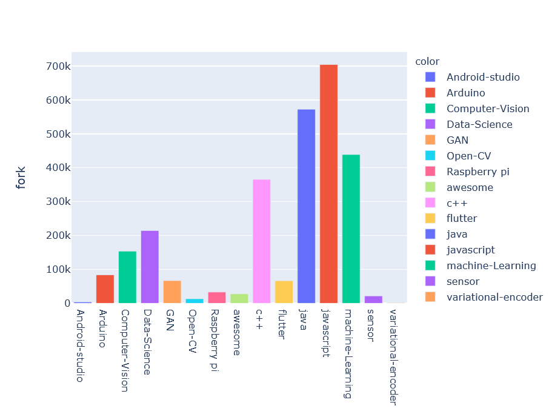
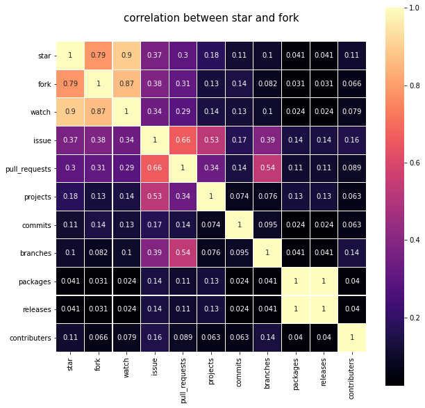
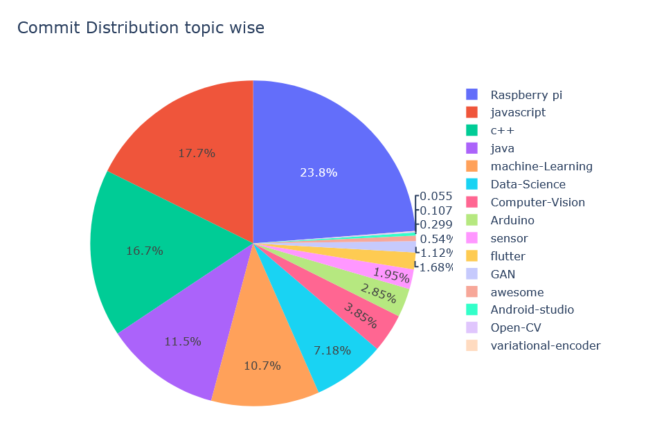
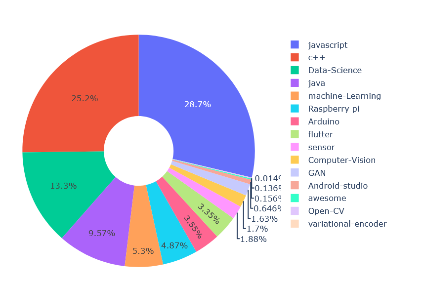

# GitHub analysis 2020
<image src="Images/Git_hub.gif" width="200">
  
# Web Scraping

## Context 

**You can star repositories to keep track of projects you find interesting.**
I have Scraped top stared repositories from GitHub with different topics. I have used Python BeautifulSoup to scrape the data. The main motivation behind this data is to analyze top GitHub stared repositories.

I have selected some topics like Data-Science, Machine-Learning, Computer-Vision, etc. Then I have watched most stared 100 repository details including repository commits, issue, fork, etc.
 
## GitHub 

## Content
There are more than **1500** repository nformation.

Data contains the main 19 columns:
1) **topic**: A base word with the help of its fetched repository.
2) **name**: repository name.
3) **user**: repository user name.
4) **star**: stars are given by users.
5) **fork**: number of the fork that specific repository.
6) **watch**: repository watch
7) **issue**: number of issue in that repository.
8) **pull_requests**: number of pull requests 
9) **projects**: a number of projects undergoing that topic_tag.
10) **topic_tag**: tag added to the repository by the user.
11) **discription_text**: short discription added by user.
12) **discription_url**: additional url provide by repository.
13) **commits**: number of commits to that repository.
14) **branches**: a number of different branches of the repository.
15) **packages**: number of packages.
16) **releases**: releases of the repository.
17) **contributors**: a number of users have contributed to the repository.
18) **License**: name of License.
19) **url**: URL of the repository.

**current repository topics**: Data-Science, Machine-Learning, Open-CV, Computer-Vision, GAN, variational-encoder, Android-studio, flutter, JAVA, awesome, javascript, c++

**stay tuned for more topics.**

## &#x1F4D8; Kaggle Kernel [click here](https://www.kaggle.com/vatsalparsaniya/github-analysis-2020-eda)
### &#x1F53C; Please!!! Upvote Kaggle kernel if you find it useful.

# Exploratory data analysis

## Repository tags used by users

* we can see above machine-learning and deeplearning tags are used more then 200 times 

## Repository star distribution topic wise

* we can see here javascript topic has most stared repository (total 4M+)
* also we know that machie-learning is most usable tags rather then machine-learning repository are not stared as much as java-script
* Android-studio, opencv, sensor,variational-encoder are thos topic which accumulated sum are very low
* Data-science,computer-vision is most hot topic these days but data-science repositerys are not as much stared compared to oter topics

## Repository Fork distribution

* we can see here similarity between repository star and forks
* java-script's repository are most stared and forked also

## correlation

* star and watch are more correlatd (0.9)
* star and fork is less correlated compare to other two
* (Star & watch) > (Fork & watch) > (star > fork)

## Commit Distribution topic wise

* Defenetly Raspberry-pi topic have less star and forks but it wins in commits 

## Contributers Distribution

* Java-Script again win the game
* Data-Science and c++ topics are came forward. they are not at 2nd and 3rd place in star and fork repository

### For More Analysis go to my Kaggle Kernel
